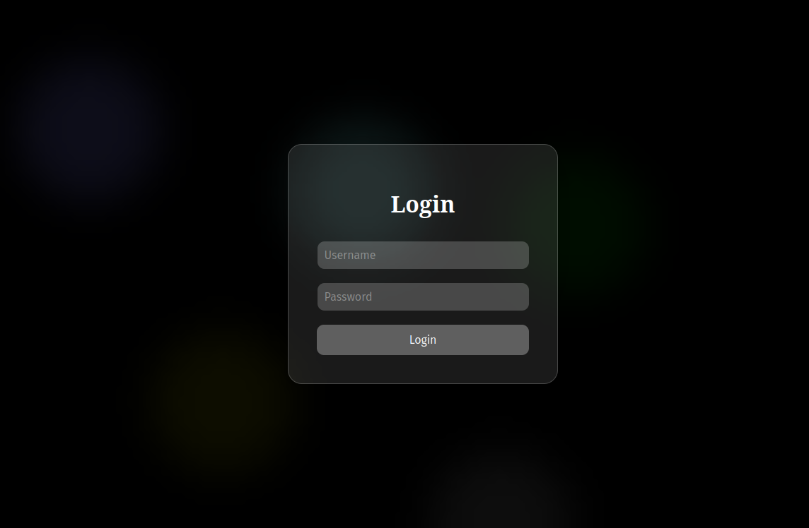
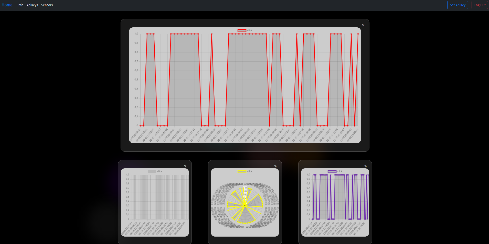
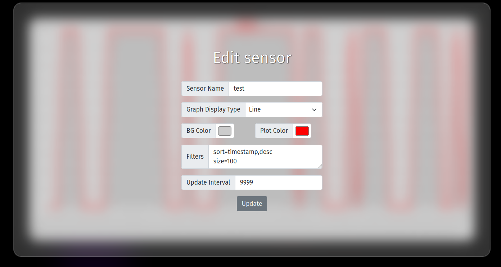
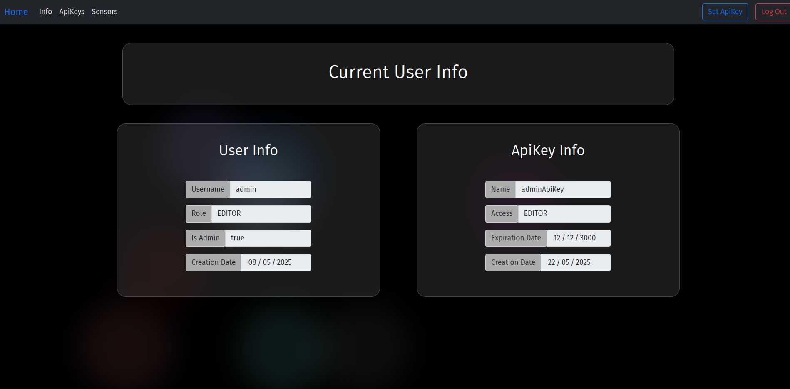

# Basic FrontEnd Design

This are the files of the frontend for the api

The web server is just basic .html .css .js so any web server should work

In the setup where we developed this, we used nginx in an arch linux machine. We recomend using the path /srv/http/... 

